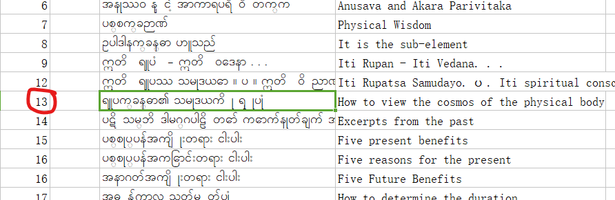
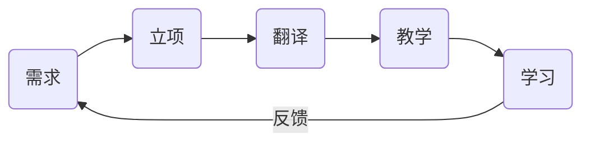
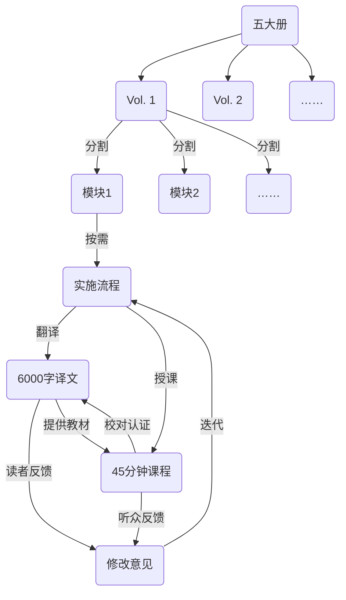
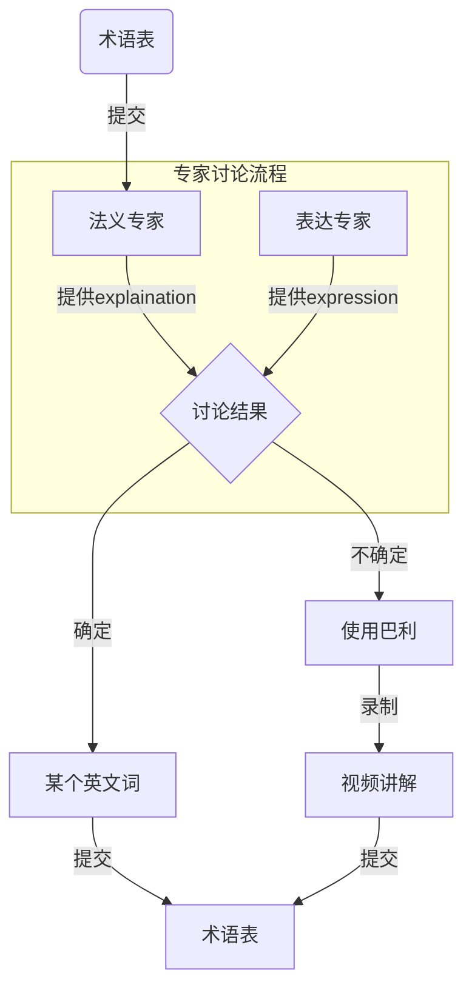

# 流程

1.  制作 markdown 文件：

    > 原则：将西亚多的文档不删改地制作 markdown，尽量还原为纸质版排版方式

    1.  根据已经确认的目录在该书下建立空白 markdown 文档。文档目录结构与原书相同。原书目录中的一篇文章为一个 markdown 文档。文件名为 vol-书号-页码.md(例子： vol-2-345.md) 如果一页有两个标题 vol-书号-页码-a.md vol-书号-页码-b.md
        例子：第一本书 第十三页 文件名: `vol-1-13.md`
        
    1.  根据**缅文版页码**找到缅文 pdf 中的起始位置。 a. 复制缅文到剪贴板 b. 需要使用[缅文转换工具](https://thanlwinsoft.github.io/www.thanlwinsoft.org/ThanLwinSoft/MyanmarUnicode/Conversion/myanmarConverter.html)来将原版的`Winlnnwa`转化为`Unicode`
        
    1.  更正缅文原文文本错误；可能有的错误 - Ho => oH ; Ä=>\*
    1.  根据缅文版排版，将文档改为[markdown 格式](https://www.markdown.cn/) 转换后 每句一行。两段之间用空行。
        1. **分段**两个回车（换行）表示一个段落结束
        1. **标题**。`# 一级标题` `## 二级标题`
        1. 标注**黑体字**，`**黑体字**` `*斜体字*` `***斜黑体***`
        1. **消除不应有的回行**
        1. 列表变为 **无序列表** `- 列表项目`
        1. 按照缅文句号增加**换行** 缅文句号 **။**
        1. 居右的增加`<r>居右文字</r>`标签
        1. 需要强制段内换行的使用` `标签

    

1.  导入文章 1. 新建文章 1. 粘贴文本 1. 语言设置为 my 1. 按预览按钮查看结果是否正确 1. 按导入按钮
    <<<<<<< HEAD
1.  插入英文第一版
    -   选择一个版本
    -   根据缅文页码找到 pdf 中对应的英文
    -   根据英文，找到 md 文档中的相应位置
    -   拷贝粘贴
    -   检查原英文中是否有缺的巴利文引用，如果缺，用缅文版转码(https://www.wikipali.org/app/tools/unicode.html)
1.  翻译协作：对于有巴利原文的部分需要在 wikipali 译经楼中走#标准化翻译流程；对于非巴利引述部分的文字，进行校对或重译；一切翻译均以句为单位在网站上现在制作。
1.  术语标准化：对原有译文中的所有巴利术语进行标准化替换，即`[[palispell]]`这样的方式对所有的术语进行标准化替换，这样生成一份标准译文
1.  然后在术语表中维护新增术语的用词抉择
1.  找到西亚多，对上述标准译文进行初次校对，不求精准和表达的顺畅，但求无误无歧义
1.  请西亚多针对改部分的内容进行一次 Dhammatalk，翻译小组人员可以根据西亚多的想法，协助西亚多在开示之前制作演讲稿（段落大意、段落注释等等）；同时在此过程中可以对标准译文进行再次校对即润色
1.  录播或直播这场开示，并存档，与改子模版进行挂接
1.  观看、聆听开示者，可以对标准疑问再次提出修改意见，形成标准疑问的迭代提升通道
1.  # 梳理改子模版的知识图谱（未来功能），找出更加合理的课程编排方案，对课程视频形成迭代提升通道。（包含知识点微视频的切分和制作）
1.  插入英文第一版
    -   选择一个版本
    -   根据缅文页码找到 pdf 中对应的英文
    -   根据英文，找到 md 文档中的相应位置
    -   拷贝粘贴
    -   检查原英文中是否有缺的巴利文引用，如果缺，用缅文版转码(https://www.wikipali.org/app/tools/unicode.html)
1.  翻译协作：对于有巴利原文的部分需要在 wikipali 译经楼中走#标准化翻译流程；对于非巴利引述部分的文字，进行校对或重译；一切翻译均以句为单位在网站上现在制作。
1.  术语标准化：对原有译文中的所有巴利术语进行标准化替换，即`[[palispell]]`这样的方式对所有的术语进行标准化替换，这样生成一份标准译文
1.  然后在术语表中维护新增术语的用词抉择
1.  找到西亚多，对上述标准译文进行初次校对，不求精准和表达的顺畅，但求无误无歧义
1.  请西亚多针对改部分的内容进行一次 Dhammatalk，翻译小组人员可以根据西亚多的想法，协助西亚多在开示之前制作演讲稿（段落大意、段落注释等等）；同时在此过程中可以对标准译文进行再次校对即润色
1.  录播或直播这场开示，并存档，与改子模版进行挂接
1.  观看、聆听开示者，可以对标准疑问再次提出修改意见，形成标准疑问的迭代提升通道
1.  梳理改子模版的知识图谱（未来功能），找出更加合理的课程编排方案，对课程视频形成迭代提升通道。（包含知识点微视频的切分和制作）
    > > > > > > > 76a85087a0aaab37b12d089268fd9c5a46a10c63

使用[**分治法**](https://zh.wikipedia.org/wiki/%E5%88%86%E6%B2%BB%E6%B3%95)解决大型工程问题

-   字面上的解释是“分而治之”，就是把一个复杂的问题分成两个或更多的相同或相似的子问题，直到最后子问题可以简单的直接求解，原问题的解即子问题的解的合并。

| 方法           | 特点                                     | 利益                                                                                                 |
| -------------- | ---------------------------------------- | ---------------------------------------------------------------------------------------------------- |
| 模块化需求     | 主题相对独立 内容相对独立             | 真正帮助到弘法活动解决实际问题                                                                       |
| 模块化翻译  | 碎片化 轻量化                         | **降低**老师和译者的**实施难度** - 降低老师的档期要求 - 降低译者的实施压力 - 周期短、见效快 |
| 模块化教学     | 最多 45 分钟~1 小时                      | 时间长度适合学习者                                                                                   |
| 模块化发布     | 对于受众更具备针对性 减少供需的盲目性 | 不必等待完本才发布 可连载                                                                         |
| 模块化学习     | 利用碎片时间学习                         | 受众不必等待完本即可抢先阅读 受众可以追更                                                         |

### 术语

## 缅文：

1. 切分 pdf 10 页一个文件
2. zonepdf -> word
3. unicode converter -> unicode
4. https://products.aspose.app/words/conversion -> md

## 英文：

https://products.aspose.app/words/conversion/pdf-to-md 直接 pdf->md
