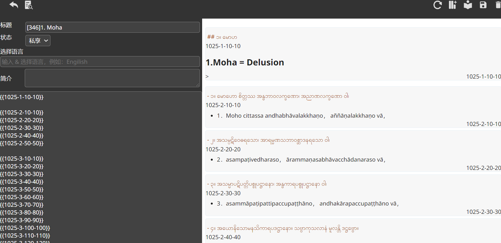
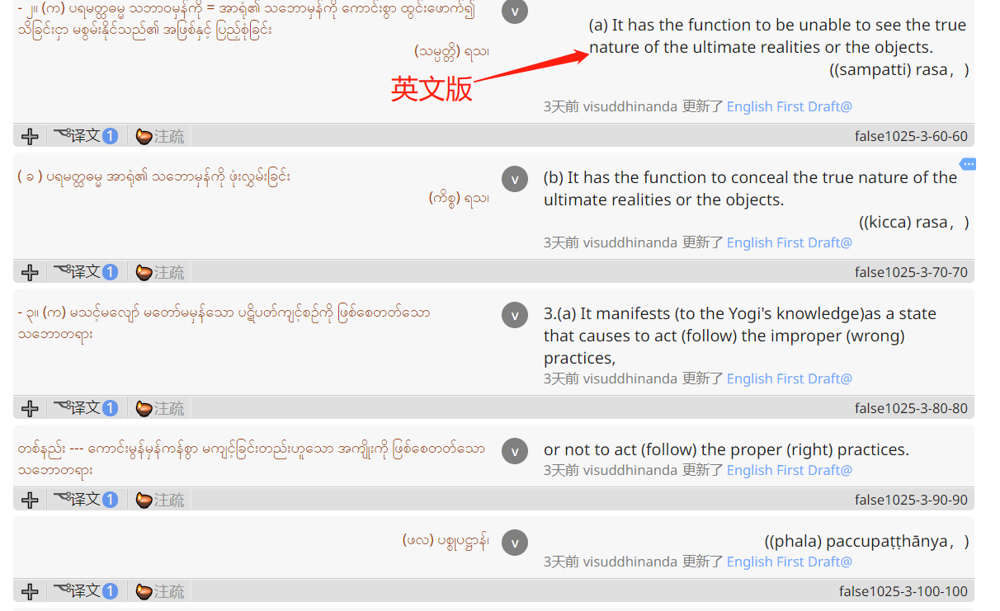
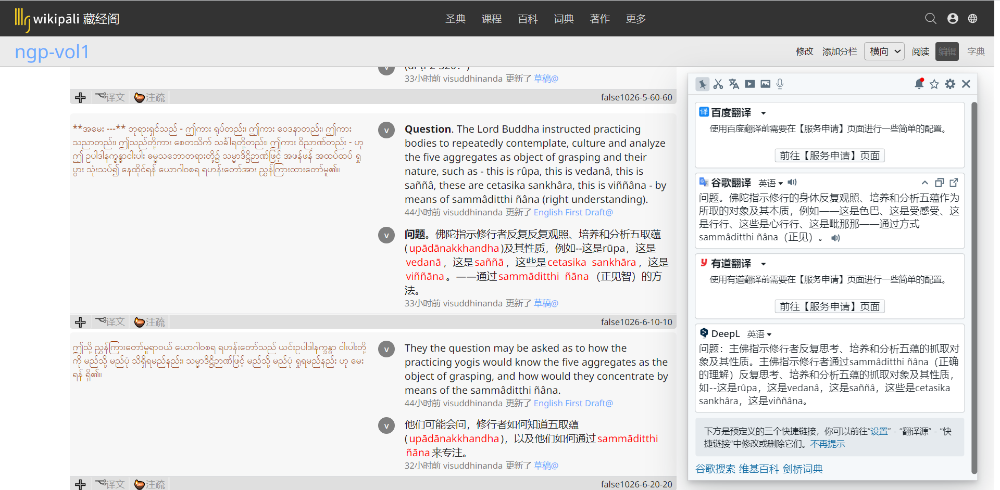

# 去向涅槃之道中文版翻译计划

## 目标

利用现有的英文译文和缅文原文以及书中的巴利语引用，翻译出一份通顺易懂，尽量照顾不懂巴利语及没有高深佛法知识的普通信徒。

**不校对英文版**。目前来看，人力缺乏。只是利用英文版做参考翻译中文版。

## 目前资料

1.  非 unicode 编码的缅文原文 pdf
2.  英文第一版版(有些巴利语为非 Unicode 编码) pdf 格式

## 工作平台

全部翻译工作在 wikipali 平台进行。目前平台支持任何从左到右书写的语言的协作翻译与内容发布。

## 步骤

### 1.数据准备

1. 缅文导入

将缅文 pdf 经过转码导入 wikipali 数据库

导入后是这个样子

只有缅文.逐句.

2. 英文译文插入。将英文逐句插入数据库，与缅文对应

插入后是这个样子

### 2.粗译

借助机器自动翻译，将英文译成中文，
对其中的错误进行修改。

标注巴利语术语 如 rūpa->\[\[rūpa\]\]

粗译后是这个样子

### 3. 精译

利用英文版和缅文版（可选）仔细校对粗译的译文。

### 4. 审核

利用缅文版和巴利原文审核中文版正确性。

### 5. 试读

组织小规模试读。根据试读意见修改译文

### 6. 公开发布

# 工作块划分

将五大册根据缅文版目录切分为小节。

以小节为单位翻译审核。可以考虑以连载形式发布

组织 1-5 个翻译小组，最少一个，最多五个 每个小组人员结构相同。

# 岗位职责和能力需求
