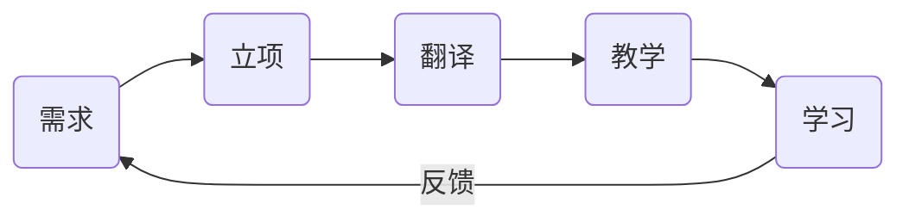
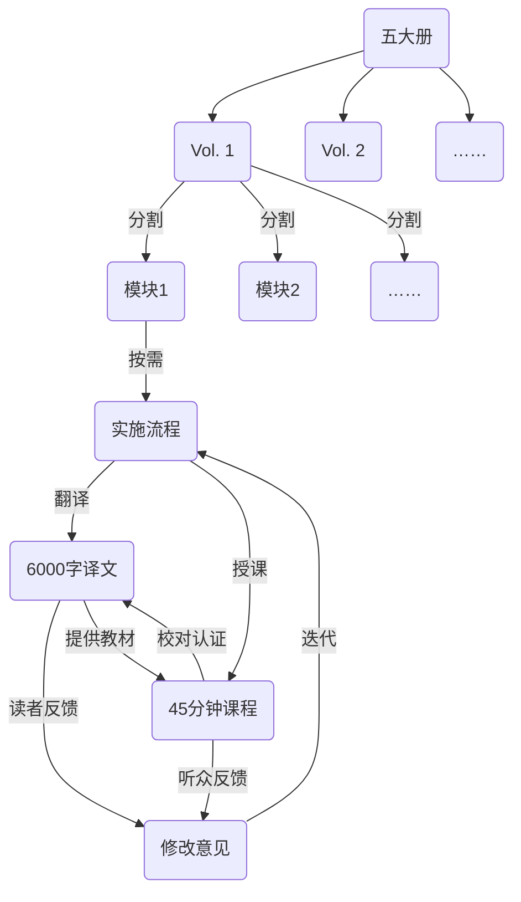
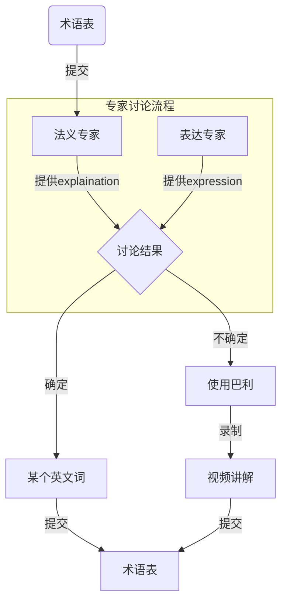

# 流程

1. 制作子模版：
    1. 原则：可以还原为纸质版
    2. 将西亚多的文档不删改地制作 markdown，不增不减，独立意群，篇幅控制在 45min-1h 以下
    3. 导入译文句子库，language 为缅文，分配 Channel ID=原版，程序生成链接组成的新模板，作为**原版**发布
    4. 使用缅文版作为母本来制作模版，根据缅文原版目录，来控制一个子模版的篇幅。这样，每一个模版的篇幅不会太长，可以满足随作随发，以这个子模版为单位进行协作，实现任务的碎片化和自由化。
    5. 需要使用[缅文转换工具](https://thanlwinsoft.github.io/www.thanlwinsoft.org/ThanLwinSoft/MyanmarUnicode/Conversion/myanmarConverter.html)来将原版的`Winlnnwa`转化为`Unicode`
    6. 缅文原文文本错误
        - Ho = oH
2. 优化模版：
    1. 对其中的巴利原文引述**添加链接**，且**保留**缅文**原文**
    2.
    3. 并将子模版放入书籍索引列表，实现对碎片化数据的梳理。
3. 翻译协作：对于有巴利原文的部分需要在 wikipali 译经楼中走#标准化翻译流程；对于非巴利引述部分的文字，进行校对或重译；一切翻译均以句为单位在网站上现在制作。
4. 术语标准化：对原有译文中的所有巴利术语进行标准化替换，即`[[palispell]]`这样的方式对所有的术语进行标准化替换，这样生成一份标准译文
5. 然后在术语表中维护新增术语的用词抉择
6. 找到西亚多，对上述标准译文进行初次校对，不求精准和表达的顺畅，但求无误无歧义
7. 请西亚多针对改部分的内容进行一次 Dhammatalk，翻译小组人员可以根据西亚多的想法，协助西亚多在开示之前制作演讲稿（段落大意、段落注释等等）；同时在此过程中可以对标准译文进行再次校对即润色
8. 录播或直播这场开示，并存档，与改子模版进行挂接
9. 观看、聆听开示者，可以对标准疑问再次提出修改意见，形成标准疑问的迭代提升通道
10. 梳理改子模版的知识图谱（未来功能），找出更加合理的课程编排方案，对课程视频形成迭代提升通道。（包含知识点微视频的切分和制作）

使用[**分治法**](https://zh.wikipedia.org/wiki/%E5%88%86%E6%B2%BB%E6%B3%95)解决大型工程问题

-   字面上的解释是“分而治之”，就是把一个复杂的问题分成两个或更多的相同或相似的子问题，直到最后子问题可以简单的直接求解，原问题的解即子问题的解的合并。

| 方法           | 特点                                     | 利益                                                                                                 |
| -------------- | ---------------------------------------- | ---------------------------------------------------------------------------------------------------- |
| 模块化需求     | 主题相对独立 内容相对独立             | 真正帮助到弘法活动解决实际问题                                                                       |
| 模块化翻译  | 碎片化 轻量化                         | **降低**老师和译者的**实施难度** - 降低老师的档期要求 - 降低译者的实施压力 - 周期短、见效快 |
| 模块化教学     | 最多 45 分钟~1 小时                      | 时间长度适合学习者                                                                                   |
| 模块化发布     | 对于受众更具备针对性 减少供需的盲目性 | 不必等待完本才发布 可连载                                                                         |
| 模块化学习     | 利用碎片时间学习                         | 受众不必等待完本即可抢先阅读 受众可以追更                                                         |

### 术语

